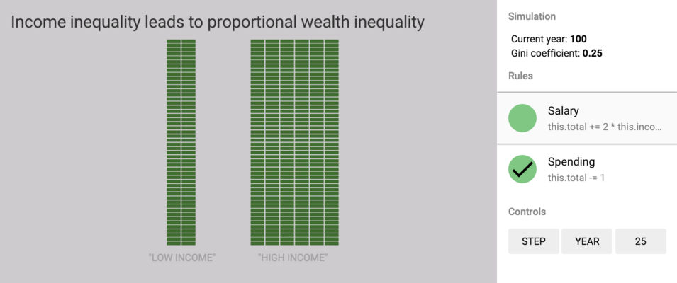

Wealth inequality simulator
===========================

This is a tool for creating simple simulations of wealth inequality. Each
simulation consists of rules and households. As the simulation unfolds, rules
are executed in order, and each rule is applied to each household, affecting
household wealth. Here is the definition of a simple simulation, in which two
households have different incomes:

```javascript
var rules = [
  {label: 'Salary', action: 'this.total += 2 * this.incomeMultiplier'},
  {label: 'Spending', action: 'this.total -= 1'},
];
var simulation = new Simulation(rules);
simulation.addActor({
  label: 'Low income',
  incomeMultiplier: 1,
});
simulation.addActor({
  label: 'High income',
  incomeMultiplier: 2,
});
```

This code is lifted from [this simulation file][src]. The simulation file can be
loaded by passing it in as a GET argument, using a URL like this one: <https://borismus.github.io/inequality-simulator/?model=1-world-income-ineq-doesnt-lead-to-wealth-ineq.js>.

Which results in the following output:

[][demo]

For more info, please read the blog post here:
<http://smus.com/simulating-wealth-inequality>

[src]: https://github.com/borismus/inequality-simulator/blob/master/1-world-income-ineq-doesnt-lead-to-wealth-ineq.js
[demo]: https://borismus.github.io/inequality-simulator/?model=1-world-income-ineq-doesnt-lead-to-wealth-ineq.js
